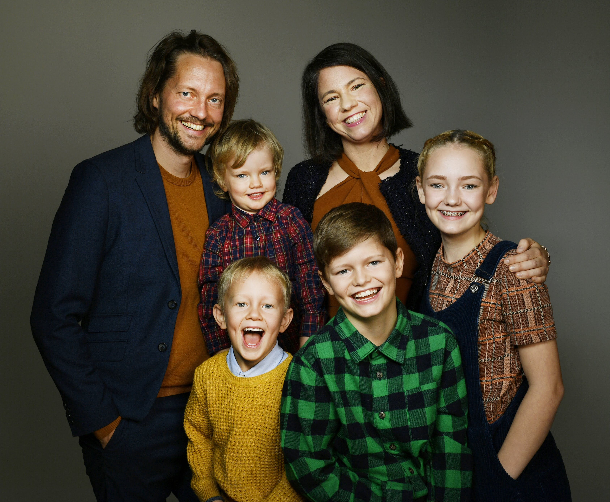

Our home is at [Odelbergsvägen 36, Enskede gård](https://goo.gl/maps/isqoTqnuZBR3AW246).

The entry code for the front door is **1472** and works until 10 PM - after that you use the apartment key to enter.

The key to our apartment is at our neighbours place - Jimmy Jansson & Victoria Nordahl.
They are on vacation, but their son Julius is at home and ready to hand you the keys.
He's expecting you at 3 pm on the 12th. His phone number is [072 248 16 07](tel:072 248 16 07).

### Public transport

Stockholm Local traffic, SL:
  - [Trip planner](http://sl.se/en/)
  - [Fares](http://sl.se/en/fares--tickets/)

You ned an _access card_ for public transport which you buy for 20 SEK at the infomation desk at the central station where you arrive with your train.
The information desk is located one floor down from the central station main hall.
The access card can then be charged with travel credits - “reskassa” - at the vending machines available at subway gates.

Our closest subway stop is _Enskede Gård_, 100 meters from our home.
It’s on the green line **#19** towards _Hagsätra_

Unfortunately line #19 is closed between _Gullmarsplan_ and _Globen_ for construction work during summer.
You can either walk the one stop from _Gullmarsplan_ to _Globen_ - around 600 meters - and then take the subway again another stop from _Globen_ to _Enskede Gård_.
Or, you can take the _tvärbanan_ tram three stops from _Gullmarsplan_ to _Linde_ and then walk from there, ~700 meters to our apartment.
Perhaps there are also replacement buses, the information desk can give you any information you need.

### Bedrooms

We made the beds with clean linen. At the end of the stay you can just strip the beds and put them in the bathroom, and we will take care or the washing up.
There are extra linens in the closet facing Vide and Egils room in case you need it.

### Bathroom

There are clean towels in the wall cabinet. The washing powder is also in the cabinet.

### Kitchen

Recycling is divided into regular waste, food scraps (brown paper bags), plastics, metal, batteries, glass, colored glass, paper and cardboard.
Paper/cardboard bins are in the linen cupboard, opposite Vide and Egils room.
The garbage room is to the right of the entrance of the opposite building, number 34, and you use the apartment key to get in.

Powder for the dishwasher is in the cupboard above the dishwasher.
There is a percolator for coffee in the cupboard above the freezer.
Please take what you like in the cupboard, fridge and freezer.

### Livingroom

To use the TV set, open the cabinet and turn on the red power switch. Then use the Samsung remote to choose source.
The digital box is on _Ext._ and you change channels with the Motorola remote.
The Apple TV is on _HDMI1_ and the PS3 on _HDMI2_.

Our WiFi is named _BigHero6_ and the password is _oriavehl_. In case of connectivity issues try powering the router off and on again.
The router is in the closet behind our bedroom.

### Patio

There's been construction work on our building during may-june, and it's not yet finished.
I think the patio will be in ok shape by the time you arrive, but I don't think the furniture will be put back in place by the construction workers.
If you want to sit there you can just arrange the sofa and the table so that you can use them.
Or just go take your morning coffee on the stairs by the playground which we often do.

### Places to visit

We’ve put together a map of different places in our neighborhood and around Stockholm.
Everything from grocery stores to museums and outdoor activities.
[Check it out!](https://drive.google.com/open?id=1NGujzVNI1lADjlOzOTOPcUww1ncUwS1S&usp=sharing)

We hope you will enjoy your stay!

